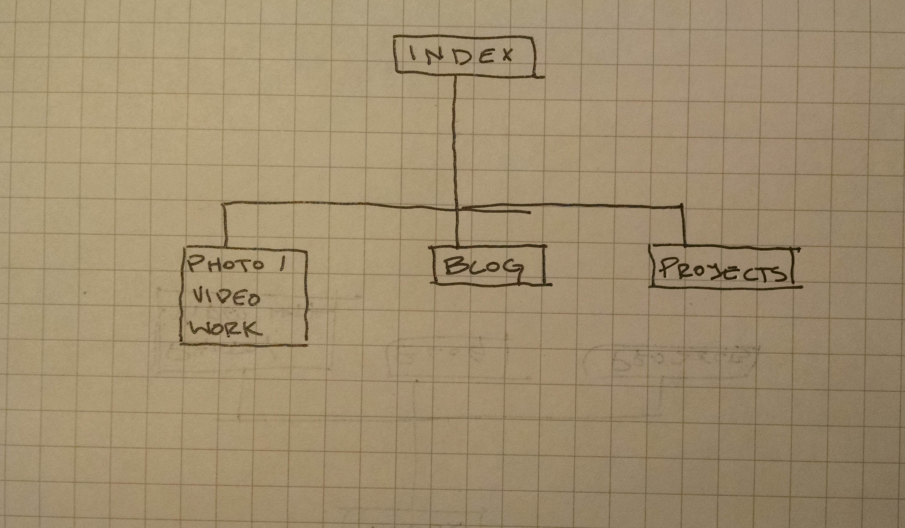

## What are the 6 Phases of Web Design?

Information gathering, planning, design, development, testing/delivery, and maintenance.

## What is your site's primary goal or purpose? What kind of content will your site feature?

To act as a personal web site for myself and, hopefully, future employers.  It will include examples of my work and my blog.

## What is your target audience's interests and how do you see your site addressing them?

I think the target audience's interests will be in viewing my work and maybe blog postings.  The site will prominently display both of these so that they are easily found.  

## What is the primary "action" the user should take when coming to your site? Do you want them to search for information, contact you, or see your portfolio? It's ok to have several actions at once, or different actions for different kinds of visitors.

Probably to see my portfolio, and then contact me.  Obviously this site is intended to display a lot of the work accomplished at DBC.  I am also a photography and would like to make a site to display my work for that. Though I do not know if these will be two separate projects or if there is a way to incorporate them together.  Infact possibly designing a page to display photo and video work is additionally a display design.

## What are the main things someone should know about design and user experience?

Design needs to be intuitive. It is the actual lay out of a site.  That being said, it is not the same as user experience.  Which refers to how a user feels after using the site.

## What is user experience design and why is it valuable? 

User experience is how a person feels interacting with a computer system.  It is important because it can have a huge effect on how people use or maybe stop using certain websites or systems. It seems to be much more of a subconscious aspect of design.  Something people will realize only if it's off.  I imagine that you don't think about good UX while poor examples give people reasons to dislike or complain about a system.  I often liken it to audio in a movie.  When a movie's audio is perfect, you don't even notice it.  Because you are so involved in the rest of the movie and the audio helps transport you to that universe.  But if the audio is a poor recording or not processed correctly its blaringly obvious.

## Which parts of the challenge did you find tedious?

I got tripped up over linking the image through the relative path.  I used "/img/site-map.jpg" while it should just be "img/site-map.jpg"  So that got a bit annoying for a while.  