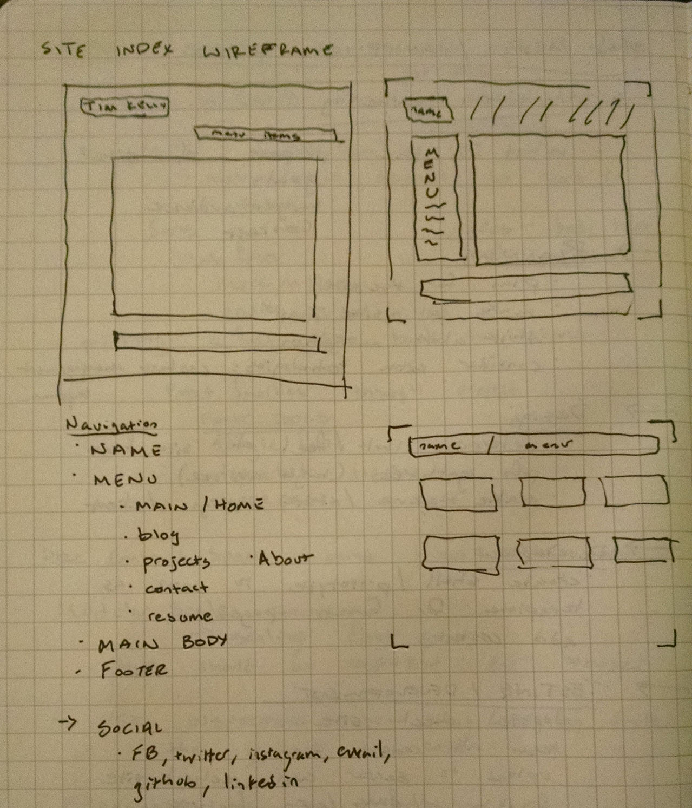

## What is a wireframe?

A wireframe is a basic visual representation on the site layout made either by sketching or with wireframe software.

## What are the benefits of wireframing?

Wireframing allows you to get your ideas onto paper.  Just like writing an outline for a paper, a wireframe allows you to begin to see what the project will look like visually.  

The amount or detail of the wireframe sketch is up to the user.  It can begin of a very basic layout of the elements and evolve into a detailed black and white version of the site, including text, buttons, and links.

Wireframes, especially detailed ones, allow you to see what visually works and what doesn't. It gives you an opportunity to rework your design before you start coding.  It also allows you to show a client a basic version of the site design.

## Did you enjoy wireframing your site?

Yes and no.  I do enjoy making sketches and trying to determine the layout of the site.  Though I'm not very content with mine right now but I think I just don't have a full picture of it in my mind.  I'm sure I'll revise it in the future.

## Did you revise your wireframe or stick with your first idea?

I made several wireframe sketches for the site.  There wasn't a single layout that I could easily pick to stick with.  

## What questions did you ask during this challenge? What resources did you find to help you answer them?

The wireframe blog index confused me (as you'll see on the markup).  If it is simply a page consisting of links to the recent blog entries I thought it would follow the same design layout as the first index for consistency.  This seems kind of bland to me and like a slightly unnecessary step or page.  Alternatively I thought something like an expanding menu or drop down from the blog link/button could alleviate this. Maybe this is too advanced for the website right now?

## Which parts of the challenge did you enjoy and which parts did you find tedious?

I got very overwhelmed by all of the wireframe software options between which ones were free or paid for, download vs in browser, and learning to to actually use them (I have a hard time *not* going through all the options and menus), etc. I could have easily spent hours going through them all.  Additionally, one of the articles spoke of the advantages of using Illustrator in conjunction with Photoshop, which does sound more appealing to me but I did not want to open that can of worms right now.  I definitely found this part to be the most tedious.  

Instead I turned to the analog method of pen/pencil and paper, which I preferred because I felt like I had a lot more control over making the sketches as opposed to searching for the right box, image, or button icon. I also learned and changed my approach to this for the second wireframe. 

For future wireframes I definitely see myself sketching first before moving to any sort of wireframe software.  The extra step of getting it onto paper helps translate my ideas rather than staring at the screen trying to pull the design out of my head.    

