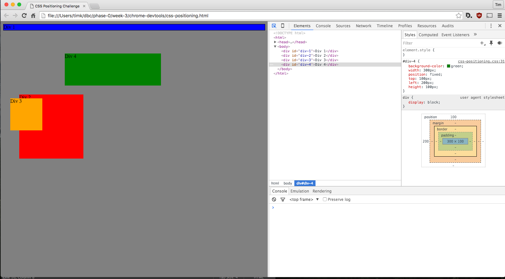
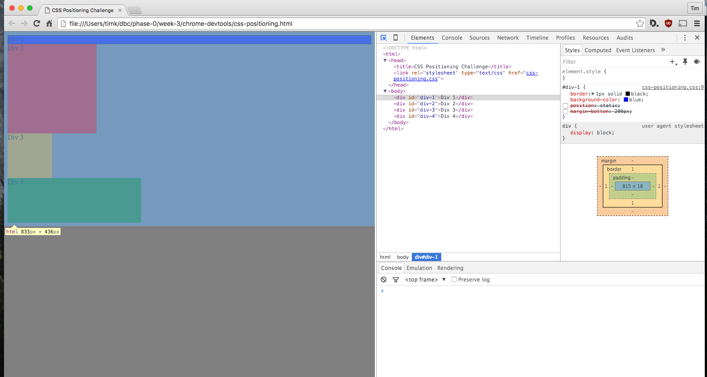
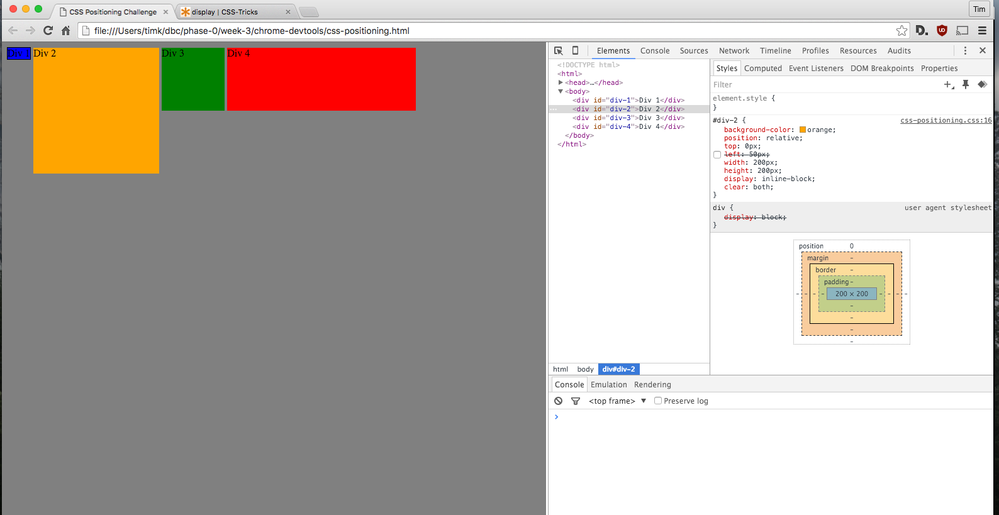
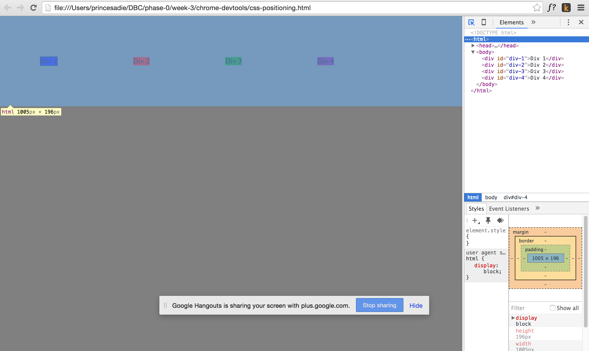
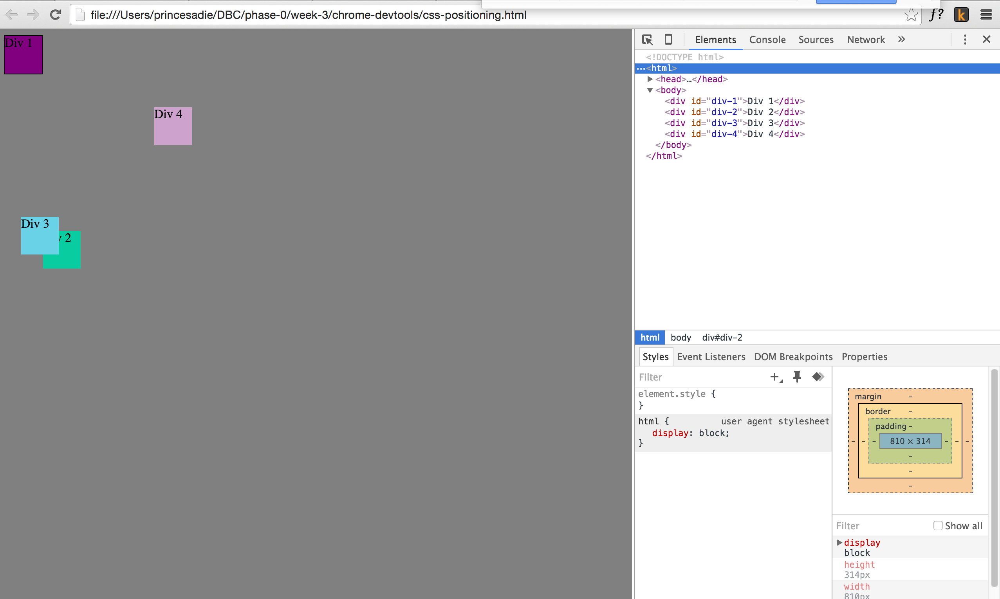
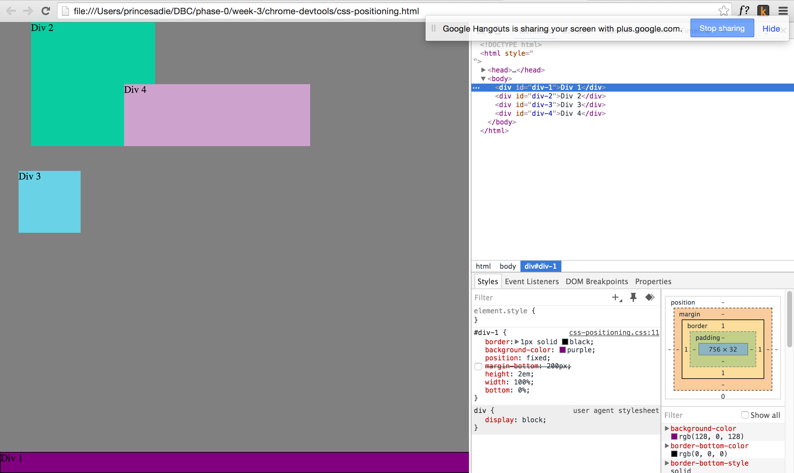
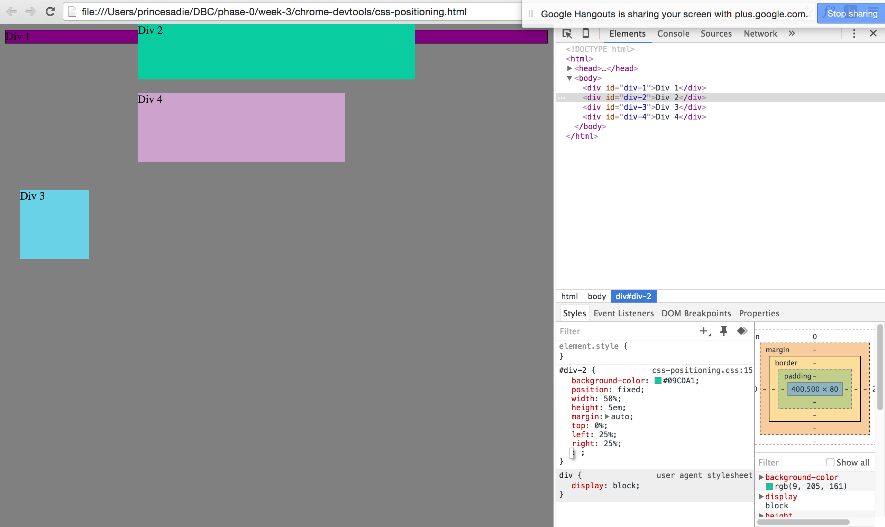
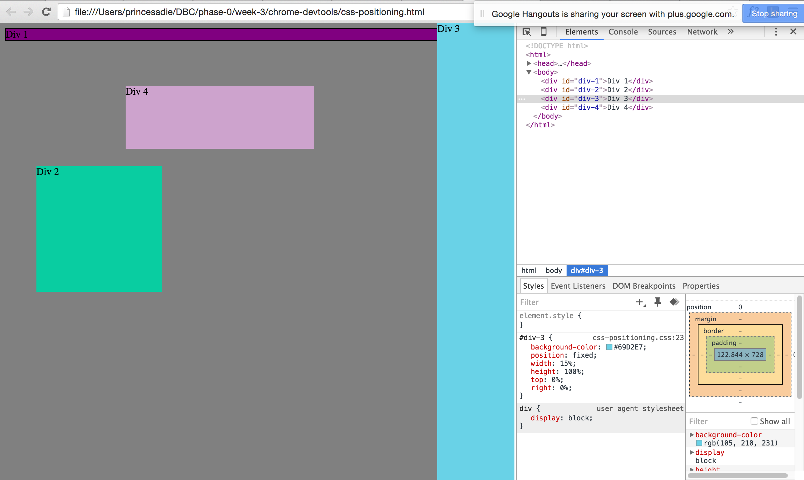
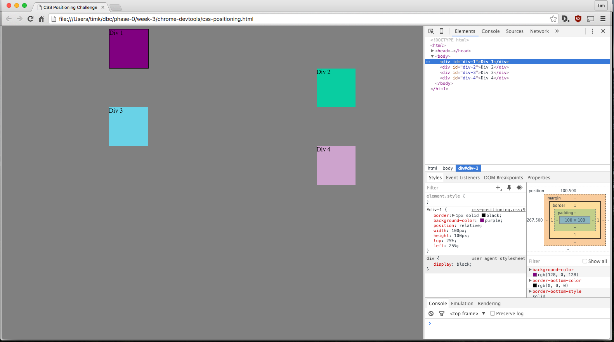

#3.3 Reflection

#How can you use Chrome's DevTools inspector to help you format or position elements

It's extremely helpful to see the changes in CSS code actively, rather than making changes, saving them, and then reloading the page.  The devtools also assists in locating code and seeing how it effects the page.  

#How can you resize elements on the DOM using CSS?

I'm not sure I entirely understand this question.  CSS can alter the way objects look in terms of their color, font, size, etc, as well as their location in the document.  I've read that through javascript you can alter the DOM but I'm not familiar with that right now.  

#What are the differences between absolute, fixed, static, and relative positioning? Which did you find easiest to use? Which was most difficult?

- **Static** is the default positioning.  This is where the element would normally place itself in the document.  Seems to be rarely used.
- **Relative** as it sounds is positioning that is relative to itself.  Use of top, bottom, left, right will place a relative element that direction from where it would have normally been placed. Relative also allows the use of z-index, which determines what elements will be seen on top of others.  Think layers in photoshop. 
- **Absolute** is the placement of an element specifically where you want it. It is important to note that absolute is still relative to its parent element.  If no parent is found (poor orphan absolute element! :( ), it will default to the html. 
- **Fixed** positioning keeps an element in place even when the viewpoint is changed, aka the user scrolls down.  Could be used for navigation bars.  Can cause usability issues with screen sizes however.

#What are the differences between margin, border, and padding?

The Margin surrounds the border of the element and has to do with its location in relation to other elements.  The border surrounds the object itself, outlining it though it can be adjusted by the padding, which is inbetween the object and the border.

#What was your impression of this challenge overall? (love, hate, and why?)

This challenge was very useful.  While it definitely got frustrating at times, it was a great way to begin learning about css positioning. I'm starting to grasp the concepts of positioning and layout a little more.  I think I'm going to go back and review the code academy sessions on this again.  

