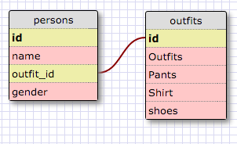

## 8.4 Introduction to Database Schemas and SQL

### 1. Select all data for all states.

    SELECT * FROM states;

### 2. Select all data for all of the regions

    SELECT * FROM regions;

### 3. Select the state_name and population for all states

    SELECT state_name, population FROM states;

### 4. Select the state_name and population for all states ordered by population. The state with thehighest population should be at the top.

    SELECT state_name, population FROM states ORDER BY population DESC;

### 5. Select the state_name for the states in region 7.

    SELECT state_name FROM states WHERE region_id = 7;

### 6. Select the state_name and population_density for states with a population density over 50 ordered from least to most dense.

    SELECT state_name, population_density 
    FROM states 
    WHERE population_density > 50 
    ORDER BY population_density ASC;

### 7. Select the state_name for states with a population between 1 million and 1.5 million people.

    SELECT state_name 
    FROM states 
    WHERE population BETWEEN 1000000 AND 1500000;

### 8. Select the state_name and region_id for states ordered by region in ascending order.

    SELECT state_name, region_id 
    FROM states 
    ORDER BY region_id ASC;

### 9. Select the region_name for the regions with "Central" in the name.

    SELECT region_name 
    FROM regions 
    WHERE region_name LIKE '%Central%';

### 10. Select the region_name and the state_name for all states and regions in ascending order by region_id. Refer to the region by name. (This will involve joining the tables).

    SELECT regions.region_name, states.state_name 
    FROM regions, states 
    ORDER BY states.region_id ASC;

---

---

# Reflection
###What are databases for?

Databases are for storing and accessing data.  They become very useful when you 
have to store large amounts of data.  More so databases are used to query and 
aggregate data.

###What is a one-to-many relationship?

The advantages of relational databases stems from the relationship defined between
different tables. This allows for a much more efficient use of the tables.  One-to-Many
is one of the relationship types between two tables. Taking the United States as an example,
The country has multiple states but each state belongs to only one country. This is a one-to-many
relationship.  The one country contains many states.

###What is a primary key? What is a foreign key? How can you determine which is which?

Keys are used to identify data. Relational databases can not repeat data. Using a primary key we can
insure that there is no redundancy. Each row of data will contain a unique primary key.  A primary key
must be unique and can not contain a value of `NULL`.

A foreign key does not need to be unique and can contain `NULL`.  Foreign keys are used to link tables
together.  The foreign key on a separate table will reference the primary key of the first table.

You can determine a primary key because it can not be used twice while foreign keys can.  This is one way
to tell them apart.

### How can you select information out of a SQL database? What are some general guidelines for that?

By using the following format, filling in the column names and table name accordingly:

    SELECT column_names 
    FROM table_name;

Additional filters can be added to select specific types of data or how it is returned. These include:

* `DISTINCT` only returns unique values
* `WHERE` allows you to place a condition on the returned data
* `LIKE` can be used to return data with specific names or patterns
* `BETWEEN` filters the results to a specific range. Use this with `AND`
* `ORDER BY` determines how the results will be returned. Use `ASC` and `DESC` to change the order
* `LIMIT` determines how many results to return
