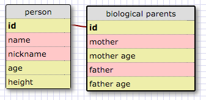
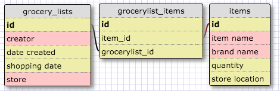

## One to one relationship

This is a one to one relationship because everyone only has one set of biological parents.

## Many to many relationship

## Reflection
* **What is a one-to-one database?**
 A one-to-one database is database containing two tables that have a single relation to each other.
* **When would you use a one-to-one database? (Think generally, not in terms of the example you created).** 
One-to-one databases are useful in situations where need to log two separate items that have a single relationship to each other.
* **What is a many-to-many database?** 
A many to many database is a series of tables that share multiple relations.
* **When would you use a many-to-many database? (Think generally, not in terms of the example you created).** 
Use a many to many database when you have tables that are the child of another table but also that table's parent table.
* **What is confusing about database schemas? What makes sense?** 
Overall they make sense, I just need more familiarity with them to get more comfortable reading them. 

